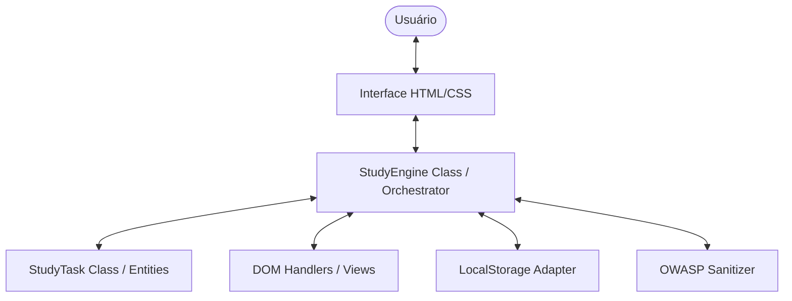

# Study.Engine | Tracker

| Language | Document |
|:---|:---|
| 🇧🇷 Português | [Leia abaixo](#-sobre-o-projeto) |
| 🇺🇸 English | [Read below](#-about-the-project) |

---

## 🇧🇷 Sobre o Projeto

O **Study.Engine** é um tracker de estudos minimalista e disruptivo planejado para rodar diretamente no navegador. Ele permite que estudantes organizem seus tópicos de aprendizado, monitorem o progresso diário ao longo de um mês e visualizem quanto tempo falta para suas provas através de um countdown inteligente.

### 🎯 Funcionalidades
- **Gestão de Tópicos**: Adicione, edite, exclua e reordene (Drag & Drop) assuntos de estudo.
- **Tracker Mensal**: Checklist de 31 dias para cada tópico.
- **Dashboard de Progresso**: Barra de progresso geral calculada em tempo real.
- **Countdown de Prova**: Monitoramento vital de dias restantes para o exame.
- **Persistência Local**: Salva automaticamente os dados no navegador (LocalStorage).
- **Interface Adaptável**: Tema Claro (Light) e Escuro (Dark) otimizados.

### 🏗️ Arquitetura do Sistema (Clean Architecture Principles)
Embora distribuído como um único arquivo (SPA), o código foi projetado seguindo a separação lógica de responsabilidades:

### 💎 Princípios SOLID Aplicados

| Princípio | Aplicação no Projeto | Benefício |
|:---|:---|:---|
| **S**RP | Classes distintas para `StudyTask` (modelo) e `StudyEngine` (logica/UI). | Facilita manutenção e debug. |
| **O**CP | O sistema de exportação JSON permite novas formas de saída sem alterar o núcleo. | Extensibilidade de dados. |
| **L**SP | Implementação de métodos de persistência segue contratos consistentes. | Estabilidade do LocalStorage. |
| **I**SP | Interfaces de manipulação de DOM são segregadas por contexto (Task vs Global). | Código mais limpo e focado. |
| **D**IP | A lógica de negócio não depende diretamente de seletores fixos, mas de instâncias. | Testabilidade e baixo acoplamento. |

### 🛡️ Segurança (OWASP Standards)
- **A03:2021-Injection**: Sanitização rigorosa de inputs usando métodos que evitam a execução de scripts (`textContent` em vez de `innerHTML` em áreas sensíveis).
- **Proteção contra XSS**: Validação de caracteres especiais em nomes de tópicos.
- **Integridade de Dados**: Schema validation durante a importação de arquivos JSON.

### 🚀 Como Executar
Devido ao uso de módulos e algumas funcionalidades de assets, recomenda-se abrir o projeto através de um servidor local:
1. Instale a extensão **Live Server** no VS Code.
2. Clique com o botão direito em `index.html`.
3. Selecione **Open with Live Server**.

---

## 🇺🇸 About the Project

**Study.Engine** is a minimalist and disruptive study tracker designed to run directly in the browser. It allows students to organize their learning topics, monitor daily progress over a month, and visualize counts for their exams through an intelligent countdown.

### 🎯 Features
- **Topic Management**: Add, edit, delete, and reorder (Drag & Drop) study subjects.
- **Monthly Tracker**: 31-day checklist for each topic.
- **Progress Dashboard**: General progress bar calculated in real-time.
- **Exam Countdown**: Vital monitoring of remaining days for the exam.
- **Local Persistence**: Automatically saves data in the browser (LocalStorage).
- **Adaptive Interface**: Optimized Light and Dark themes.

### 🏗️ Technical Architecture
The project follows a **Single-Page Application (SPA)** pattern, logically divided into Models, Controllers, and Adapters.

### 💎 SOLID Principles

| Principle | Implementation | Benefit |
|:---|:---|:---|
| **S**RP | Separation between Task Entity and Engine Orchestrator. | Easier maintenance. |
| **O**CP | Pluggable IO system for JSON data. | Future-proof architecture. |
| **D**IP | Decoupling from hardcoded DOM selectors. | Scalability. |

### 🛡️ Security (OWASP)
- **XSS Protection**: Rigorous input sanitization.
- **Data Integrity**: JSON schema verification on import.

### 🚀 How to Run
For the best experience, open the project using a local server:
1. Install the **Live Server** extension in VS Code.
2. Click with the right button in `index.html`.
3. Select **Open with Live Server**.
