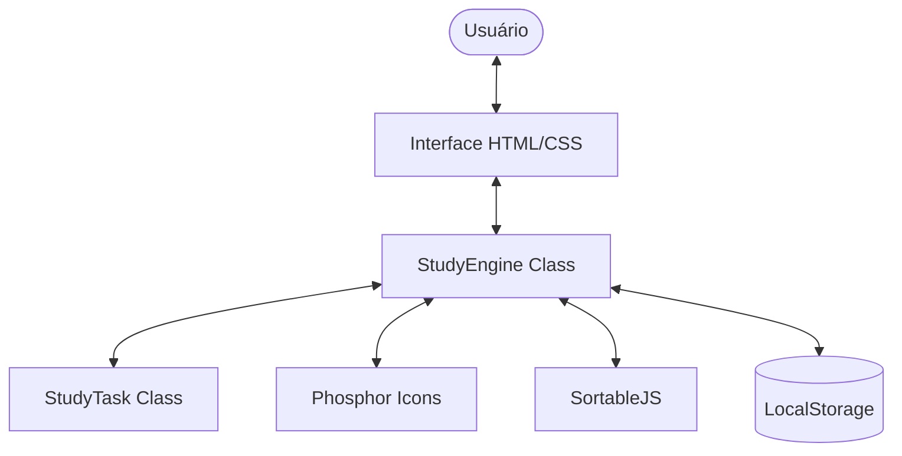

# Study.Engine | Tracker

| Language | Document |
|:---|:---|
| 🇧🇷 Português | [Leia abaixo](#-sobre-o-projeto) |
| 🇺🇸 English | [Read below](#-about-the-project) |

---

## 🇧🇷 Sobre o Projeto

O **Study.Engine** é um tracker de estudos minimalista e disruptivo planejado para rodar diretamente no navegador. Ele permite que estudantes organizem seus tópicos de aprendizado, monitorem o progresso diário ao longo de um mês e visualizem quanto tempo falta para suas provas através de um countdown inteligente.

### 🎯 Funcionalidades
- **Gestão de Tópicos**: Adicione, edite, exclua e reordene (Drag & Drop) assuntos de estudo.
- **Tracker Mensal**: Checklist de 31 dias para cada tópico.
- **Dashboard de Progresso**: Barra de progresso geral calculada em tempo real.
- **Countdown de Prova**: Monitoramento vital de dias restantes para o exame.
- **Persistência Local**: Salva automaticamente os dados no navegador (LocalStorage).
- **Portabilidade**: Exportação e importação de dados via arquivos JSON.
- **Interface Adaptável**: Tema Claro (Light) e Escuro (Dark) otimizados.

### 🏗️ Arquitetura do Sistema
O projeto segue o padrão **Single-Page Application (SPA)** contido em um único arquivo, utilizando Vanilla JS puro com manipulação de DOM baseada em classes.

### 🛡️ Segurança (OWASP)
- **Sanitização de Dados**: Proteção básica contra XSS no input de tópicos.
- **Integridade**: Validação de arquivos JSON durante a importação para evitar corrupção de estado.

### 🚀 Como Executar
Devido ao uso de módulos e algumas funcionalidades de assets, recomenda-se abrir o projeto através de um servidor local:
1. Instale a extensão **Live Server** no VS Code.
2. Clique com o botão direito em `index.html`.
3. Selecione **Open with Live Server**.

---

## 🇺🇸 About the Project

**Study.Engine** is a minimalist and disruptive study tracker designed to run directly in the browser. It allows students to organize their learning topics, monitor daily progress over a month, and visualize counts for their exams through an intelligent countdown.

### 🎯 Features
- **Topic Management**: Add, edit, delete, and reorder (Drag & Drop) study subjects.
- **Monthly Tracker**: 31-day checklist for each topic.
- **Progress Dashboard**: General progress bar calculated in real-time.
- **Exam Countdown**: Vital monitoring of remaining days for the exam.
- **Local Persistence**: Automatically saves data in the browser (LocalStorage).
- **Portability**: Data export and import via JSON files.
- **Adaptive Interface**: Optimized Light and Dark themes.

### 🏗️ Technical Architecture
The project follows a **Single-Page Application (SPA)** pattern contained in a single file, using pure Vanilla JS with class-based DOM manipulation.

### 🛡️ Security (OWASP)
- **Data Sanitization**: Basic XSS protection on topic inputs.
- **Integrity**: JSON file validation during import to prevent state corruption.

### 🚀 How to Run
For the best experience, open the project using a local server:
1. Install the **Live Server** extension in VS Code.
2. Right-click on `index.html`.
3. Select **Open with Live Server**.
